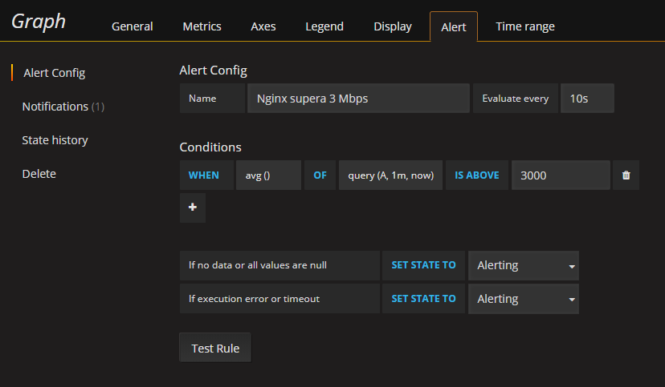
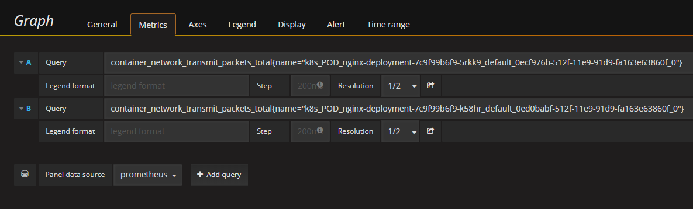
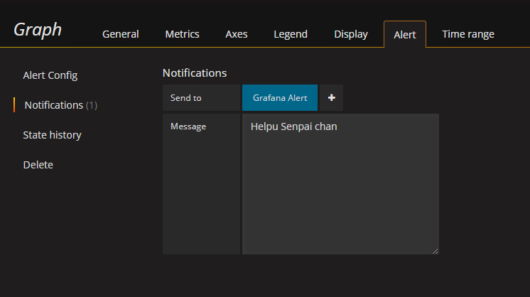

# Grafana Alert

Crearemos un bot de Telegram para que `Grafana` nos envie las alertas que le especifiquemos, en este caso, cuando el tráfico de uno de los Pod de `nginx` supere los 3Mbps de tráfico.

Vamos a `Grafana -> Alerting -> Configure notifications -> New Channel`, ponemos un nombre para este, en el campo `Type` ponemos `Telegram` y completamos los campos correspondientes al `BOT API TOKEN` y `Chat ID` con los del bot correspondiente.

Para asegurarnos de que esta conectado y funcionando, pulsamos el botón `Send Test`.

Ahora, para configurar nuestra primera alerta, vamos a `Grafana -> Dashboards -> Kubernetes Pod Resources -> Network` y damos clic y pulsamos `Edit`.

En el apartado de `Alert`, seleccionamos cualquiera de las querys que usamos en `Grafana Dashboard` y completamos el campo IS ABOVE con 3000.

Seleccionamos el apartado de `Notifications` y seleccionamos el alert de telegram que creamos antes, y establecemos un mensaje.

Le damos un nombre y guardamos, y si todo ha ido bien, cuanto se pase de los 3Mbps de tráfico, se enviará una alerta al Telegram.