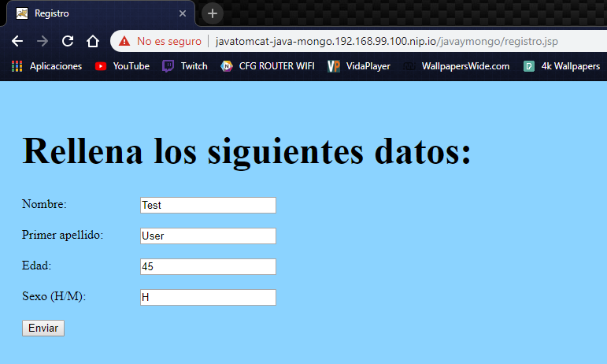
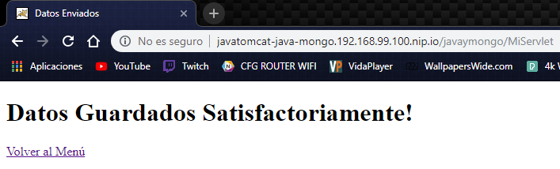
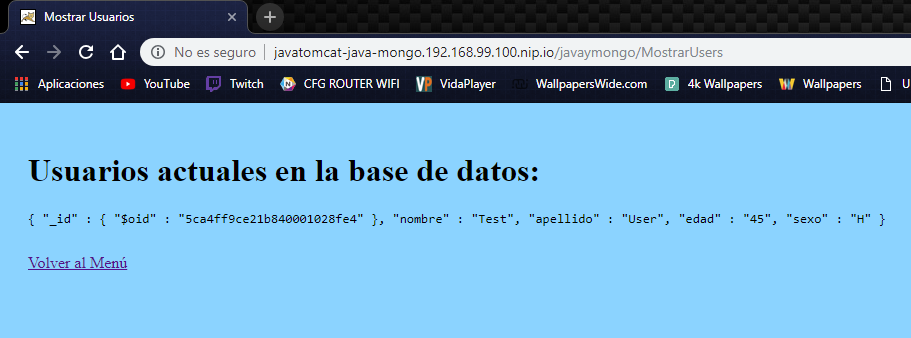

# Java Y MongoDB en OpenShift

Vamos a utilizar el usuario `developer` a lo largo de esta página, algunas imagenes corren como usuario `root`, por lo que puede que no tengamos permisos suficientes para realizarlo, por ello, desde el usuario `admin`, ejecutaremos el siguiente comando:
```sh
$ oc policy add-role-to-user cluster-admin developer
```

De tal manera que le estamos dando el role de `cluster-admin` a el usuario `developer`.

Crearemos un nuevo proyecto llamado `java-mongo` y trabajaremos sobre este.

## Creando la base de datos MongoDB
Por el momento, crearemos un MongoDB sin persitencia de datos, eso ya lo haremos posteriormente, asi que lo unico que tenemos que hacer para hacer funcionar nuestra base de datos de mongo, es hacer lo siguiente:
```sh
$ oc new-app mongo
```

Y veremos un output similar al siguiente:
```
--> Found image 394204d (19 hours old) in image stream "java-mongo/mongo" under tag "latest" for "mongo"

    * This image will be deployed in deployment config "mongo"
    * Port 27017/tcp will be load balanced by service "mongo"
      * Other containers can access this service through the hostname "mongo"
    * This image declares volumes and will default to use non-persistent, host-local storage.
      You can add persistent volumes later by running 'volume dc/mongo --add ...'
    * WARNING: Image "java-mongo/mongo:latest" runs as the 'root' user which may not be permitted by your cluster administrator

--> Creating resources ...
    deploymentconfig.apps.openshift.io "mongo" created
    service "mongo" created
--> Success
    Application is not exposed. You can expose services to the outside world by executing one or more of the commands below:
     'oc expose svc/mongo'
    Run 'oc status' to view your app.
```

Como podemos ver, esto ha creado un `DeploymentConfig`, el cual ha creado un `Pod`, y un `Service`.

```
$ oc get dc
NAME      REVISION   DESIRED   CURRENT   TRIGGERED BY
mongo     1          1         1         config,image(mongo:latest)

$ oc get pods
NAME            READY     STATUS    RESTARTS   AGE
mongo-1-crglq   1/1       Running   0          1m

$ oc get svc
NAME      TYPE        CLUSTER-IP       EXTERNAL-IP   PORT(S)     AGE
mongo     ClusterIP   172.30.130.206   <none>        27017/TCP   1m
```

## Creando la aplicación de Java

Para la aplicación de `Java`, al contrario que en las otras prácticas, la he pasado a Java Web, por lo que he creado un `.war` el cual correrá sobre una imagen de `tomcat`.

La imagen la podemos encontrar en `v3he/javatomcat`, tiene una build muy simple, unicamente tiene estas dos líneas:
```
FROM tomcat:9.0
COPY javaymongo.war /usr/local/tomcat/webapps/
```

Ahora que tenemos la imagen con nuestro tomcat, y nuestra aplicación java, crearemos una nueva app en el cluster con el siguiente comando:
```sh
$ oc new-app v3he/javatomcat -e MONGO_DB_HOST=mongo
```

Veremos un output como el siguiente:
```
--> Found Docker image bb50929 (About an hour old) from Docker Hub for "v3he/javatomcat"

    * An image stream tag will be created as "javatomcat:latest" that will track this image
    * This image will be deployed in deployment config "javatomcat"
    * Port 8080/tcp will be load balanced by service "javatomcat"
      * Other containers can access this service through the hostname "javatomcat"
    * WARNING: Image "v3he/javatomcat" runs as the 'root' user which may not be permitted by your cluster administrator

--> Creating resources ...
    deploymentconfig.apps.openshift.io "javatomcat" created
    service "javatomcat" created
--> Success
    Application is not exposed. You can expose services to the outside world by executing one or more of the commands below:
     'oc expose svc/javatomcat'
    Run 'oc status' to view your app.
```

Como podemos ver, he asignado la variable de entorno `MONGO_DB_HOST`, la cual, indica a nuestra aplicación de java, que servicio es el de la base de datos a la que se tiene que conectar, y recordemos que al crear mongo, se ha creado el servicio `mongo`, por lo que asignamos este nombre a la variable de entorno.

Al igual que en mongo, hemos creado un `DeploymentConfig`, el cual ha creado un Pod y un servicio, pero, para poder acceder a esta interfaz web de la que hablamos, de forma externa, necesitamos crear una ruta, asociada al servicio que se ha creado de `javatomcat`, asi que primero, vemos como se llama el servicio:
```
$ oc get svc
NAME         TYPE        CLUSTER-IP       EXTERNAL-IP   PORT(S)     AGE
javatomcat   ClusterIP   172.30.54.145    <none>        8080/TCP    4m
mongo        ClusterIP   172.30.130.206   <none>        27017/TCP   15m
```

Perfecto!, tenemos un servicio con el nombre de `javatomcat`, por lo que vamos a crear una nueva `Route` asociada a este:
```sh 
$ oc expose svc/javatomcat
route.route.openshift.io/javatomcat exposed

$ oc get routes
NAME         HOST/PORT                                     PATH      SERVICES     PORT       TERMINATION   WILDCARD
javatomcat   javatomcat-java-mongo.192.168.99.100.nip.io             javatomcat   8080-tcp                 None
```

Ya estaría expuesta, por lo que si ahora accedemos a `javatomcat-java-mongo.192.168.99.100.nip.io/javaymongo` accederemos a la interfaz gráfica del programa.

Vamos por ejemplo, a crear un nuevo usuario:



Y pulsamos el botón enviar, podemos ver que nos indica que se ha guardado satisfactoriamente!



Si ahora, por el contrario, vamos a ver los datos de la base de datos, podemos ver algo como lo siguiente:



Todos estos pasos que hemos realizado mediante el cliente `oc`, pueden ser realizados desde la `OpenShift Web Console`.

Ahora que todo funciona correctamente, podemos por ejemplo, replicar nuestra aplicación de Java, para ello, ejecutaremos el siguiente comando:
```sh
$ oc scale dc javatomcat --replicas=3
deploymentconfig.apps.openshift.io/javatomcat scaled

$ oc get pods
NAME                 READY     STATUS    RESTARTS   AGE
javatomcat-1-2lvmr   1/1       Running   0          12m
javatomcat-1-c9vvd   1/1       Running   0          14s
javatomcat-1-m8w7f   1/1       Running   0          14s
mongo-1-crglq        1/1       Running   0          23m
```

Y como podemos apreciar, se ha escalado correctamente.