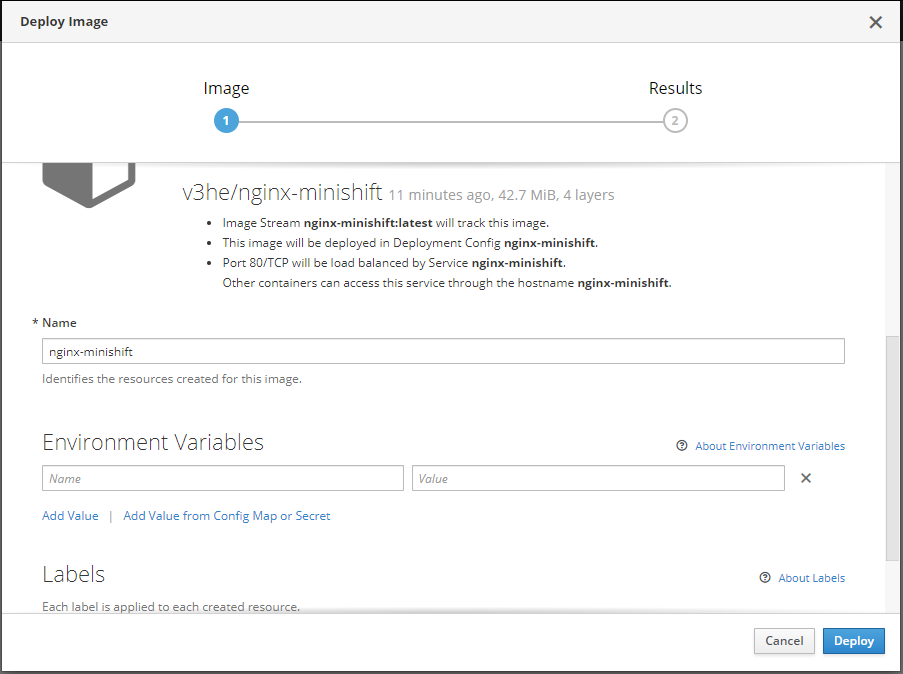

# Nginx Demo in MiniShift Cluster

Como requisitos previos debemos tener un cluster con MiniShift funcionando.
Esta vez, al contrario que en el proyecto de `nodejs-demo`, no selecionaremos la imagen desde el `Browse Catalog`, sino que crearemos nuestra propia imagen personalizada, y posteriormente la seleccionaremos.

## Creación de la imagen

Usaremos una imagen de `nginx` pero `unprivileged` para que no nos de problemas de permisos en el cluster por el momento.
(Ya nos meteremos en eso más adelante).

Creamos un `Dockerfile` con el siguiente contenido:
```
FROM nginxinc/nginx-unprivileged
COPY . /usr/share/nginx/html
```

Creamos la imagen, y la subimos al repositorio `v3he/nginx-minishift:unprivileged`.
Es una simple página personalizada que muestra unas letras en pantalla, no tiene nada más.

## Creamos un nuevo proyecto

De la misma manera que hicimos en `nodejs-demo`, cramos un nuevo proyecto sobre el que trabajar, si lo queremos hacer por comando, solo tenemos que ejecutar:
```sh
$ oc new-project nginx-demo-pablo
```

Esta vez, seleccionaremos `Deploy image`, para crear un deploy a partir de la imagen que nosotros creamos anteriormente.

Seleccionamos la casilla de `Imagen Name`, y escribimos el nombre del repositorio en el que está la imagen (`v3he/nginx-minishift:unprivileged`), a continuación, pulsamos la Lupa para que comience a buscar la imagen.

Si la ha encontrado con exito, nos ofrecerá algunas opciones que podemos modificar, como las variables de entorno, en nuestro caso, no hace falta.



Si todo ha ido bien, se debería haber creado un pod con exito, y un service asociado a este.
El problema ahora, está en que no se ha creado una `Route` automáticamente, por lo que tendremos que crearla a mano, y en este caso, lo hare por consola.
(Las rutas sirven para exponer un servicio de manera externa.)

Ejecutaremos el siguiente comando:
```sh
$ oc expose svc/nginx-minishift
```

Donde `nginx-minishift` es el nombre del servicio que esta asociado a ese pod.

Ejecutando el comando:
```sh
$ oc get routes
```

Veremos un output similar al siguiente:
```
NAME              HOST/PORT                                                SERVICE           LABELS                INSECURE POLICY   TLS TERMINATION
nginx-minishift   nginx-minishift-nginx-demo-pablo.192.168.99.100.nip.io   nginx-minishift   app=nginx-minishift
```

Asi que podemos ver, que la ruta se ha generado con exito, y que esta asociada al servicio `nginx-minishift`, por lo que si accedemos ahora a la siguiente URL `nginx-minishift-nginx-demo-pablo.192.168.99.100.nip.io`, veremos esto:


Al igual que en el proyecto anterior, podemos crear más replicas.

## Resources

- https://hub.docker.com/r/v3he/nginx-minishift
- https://hub.docker.com/r/nginxinc/nginx-unprivileged
- https://docs.okd.io/latest/dev_guide/routes.html