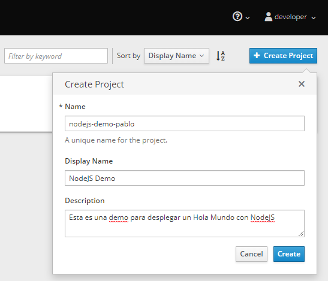
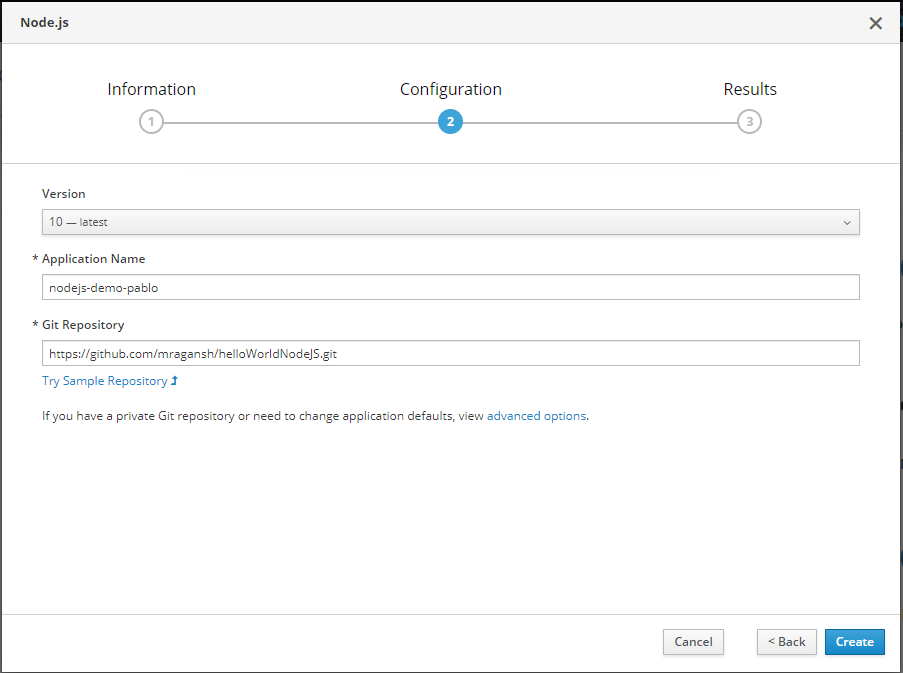
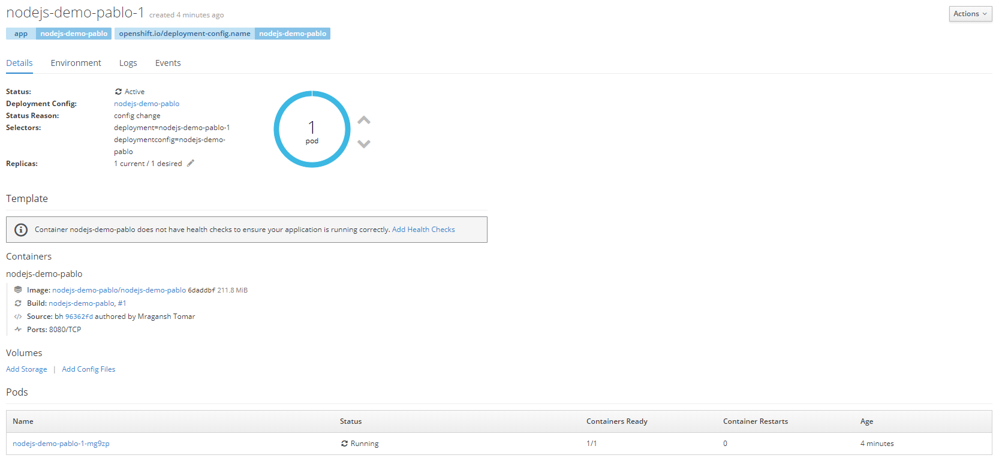
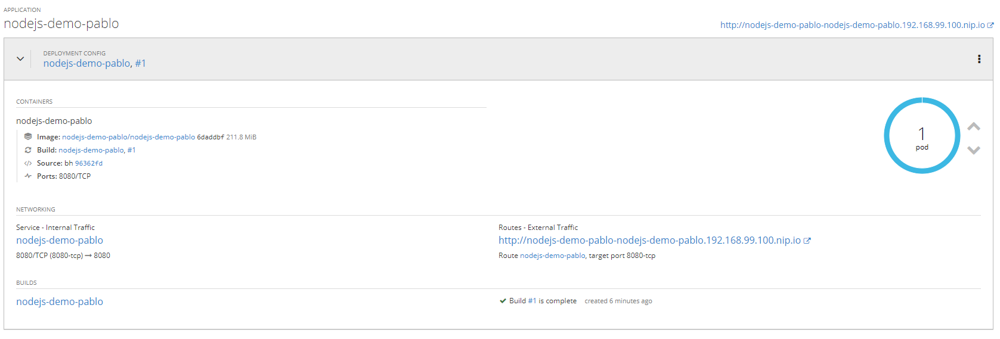
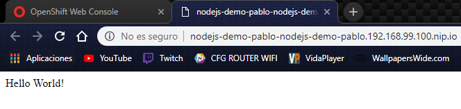
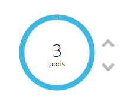

## NodeJS Demo sobre MiniShift

Como requisitos previos, debemos tener instalado y funcinando `MiniShift` así como el `CLI OC`, los cuales podemos descargar desde los siguientes enlaces:

- https://www.okd.io/minishift/
- https://docs.okd.io/latest/cli_reference/get_started_cli.html

## Inicio

Creamos un nuevo proyecto llamado `nodejs-demo-pablo`, mediante la interfaz gáfica.

### GUI



Vamos a crear un simple `Hello-World` sobre `NodeJs`, para ello, una vez que hemos creado el proyecto sobre el que vamos a trabajar, y estamos dentro, veremos una opción que pone `Browse Catalog`, seleccionaremos esta, y posteriormente, seleccionaremos `NodeJs` sobre las opciones que se nos presentan.

Al seleccionarlo, se nos mostrará un panel de configuración, estableceremos los siguiente datos:



Ese es el repositorio de git desde el cual tomará los archivos que vamos a usar, unicamente contiene un simple index cuyo contenido es un `Hola Mundo` básico.

Una vez que aceptemos todo, podremos ver que se ha creado una build correctamente, ahora ya tenemos un servicio de `NodeJs` funcionando mostrando nuestro `Hello-World`.

Al crearse, se ha creado lo siguiente:

- 1 Pod
- 1 Deployment Config
- 1 Servicio

Mediante la interfaz gráfica, podemos ver información sobre estos, por ejemplo, veamos que se muestra sobre el `Deployment`:



Como podemos ver, pone que esta en estado activo, el número `desired` es 1, y esto se cumple, ya que podemos ver que existe 1 Pod. (Más adelante crearemos más replcas sobre este.)

También podemos ver información relevante como podrían ser los `log` y de que pods esta compuesto, así como su estado.

Ahora veamos un podo de información sobre el Pod del que hablamos:



Podemos ver informacíon relevante sobre este, como por ejemplo, el servicio que utiliza para el tráfico interno, así como la ruta que se ha creado para el táfico externo. (Hablaremos sobre Routes en otro momento.)

Si accedeomos a esta `URL` que se nos muestra, veremos que efectivamente, está funcionando correctamente, y que vemos el HELLO WORLD.



Para replicar Pods mediante la interfáz gráfica, es tan sencillo como presionar las flechas hacia `arriba` o `abajo` respectivamente, y en un par de segundos, aumentaremos el número de pods, o lo reduciremos. (Podemos llegar a dejarlo en 0 Pods sin problemas.)



### Console

Es el turno de manejarnos un poco con la consola sobre el proyecto que hemos creado, y en el cual hemos desplegado un NodeJS que actualmente tiene 3 Pods.

Primero, tendremos que hacer login, al servidor `192.168.99.100` el cual es la máquina virutal de `MiniShift`, para ello, ejecutaremos lo siguiente:
```sh
$ oc login --server=192.168.99.100:8443
```

Entramos con las mismas credenciales que a la `GUI`, `developer:admin`.
Nos cambiaremos para trabajar sobre el proyecto en el cual estabamos en la interfáz gáfica, para ello:
```sh
$ oc project nodejs-demo-pablo
```

Ahora, que ya estamos sobre el proyecto, tenemos acceso a lo mismo que veíamos en la interfáz. Veamos los pods que tenemos con el siguiente comando:
```sh
$ oc get pods
```
El resultado será algo como lo siguiente:
```
NAME                        READY     STATUS      RESTARTS   AGE
nodejs-demo-pablo-1-build   0/1       Completed   0          10m
nodejs-demo-pablo-1-mg9zp   1/1       Running     0          9m
nodejs-demo-pablo-1-jf6xn   1/1       Running     0          9m
nodejs-demo-pablo-1-ud3ss   1/1       Running     0          9m
```

Como podemos apreciar, los 3 Pods de los que hablabamos anteriormente, estan con `STATUS Running`, y el otro que vemos, es el Pod que se creó a la hora de realizar la build, como bien indica su nombre.

Para ver los `Deployment Config` que tenemos, solo tenemos que ejecutar el siguiente comando:
```sh
$ oc get dc
```

Y para finalizar, veremos los detalles sobre el servicio del que hablamos dentro de los Pods en la GUI, ejecutaremos el siguiente comando:
```sh
$ oc describe svc nodejs-demo-pablo
```

Veremos información revante, como podría ser el tipo del servicio, que es `ClusterIP`, y las IP de los Pods, las cuales están en el apartado de `Endpoints`.

```
Name:                   nodejs-demo-pablo
Namespace:              nodejs-demo-pablo
Labels:                 app=nodejs-demo-pablo
Selector:               deploymentconfig=nodejs-demo-pablo
Type:                   ClusterIP
IP:                     172.30.58.221
Port:                   8080-tcp        8080/TCP
Endpoints:              172.17.0.11:8080,172.17.0.7:8080,172.17.0.8:8080
Session Affinity:       None
No events.
```