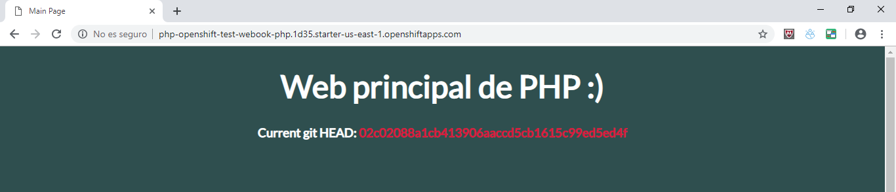
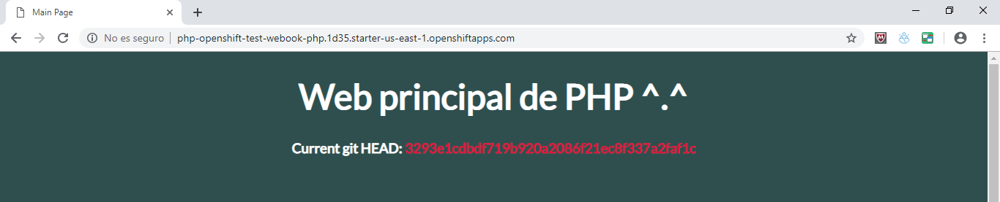

# PHP application using GitHub and Webhooks

Vamos a crear una simple aplicación en PHP con una interfaz sencilla que unicamente nos mostrará el git HEAD de la rama master, de tal forma que podremos saber a que versión pertenece la interfaz que vemos.

Para comenzar crearemos un nuevo proyecto llamado `test-webhook-php` con el siguiente comando:
```sh
$ oc new-project test-webook-php
Now using project "test-webook-php" on server "https://api.starter-us-east-1.openshift.com:443".

You can add applications to this project with the 'new-app' command. For example, try:

    oc new-app centos/ruby-22-centos7~https://github.com/openshift/ruby-ex.git

to build a new example application in Ruby.
```

Para todo el proyecto, nos basaremos en el siguiente repo de github:
```
https://github.com/Vehe/php-openshift
```

Ahora que ya tenemos el repositorio que vamos a usar, lo que vamos a hacer es crear una nueva aplicación sobre este, con el siguiente comando:
```sh
$ oc new-app php:7.1~https://github.com/Vehe/php-openshift.git
```

Con el anterior comando lo hemos indicado que queremos crear una nueva app sobre la imagen de `php:7.1` con el contenido del repositorio indicado.

Por lo que ahora, como podemos ver, se ha creado lo siguiente:
```
--> Creating resources ...
    imagestream "php-openshift" created
    buildconfig "php-openshift" created
    deploymentconfig "php-openshift" created
    service "php-openshift" created
```

Solo nos faltaría crear una route para acceder al servicio de forma externa, para ello, ejecutamos el siguiente comando:
```sh
$ oc expose svc/php-openshift
```

Y para ver la route que hemos creado, es tan sencillo como ejecutar:
```sh
$ oc get routes
NAME            HOST/PORT                                                                PATH      SERVICES        PORT       TERMINATION   WILDCARD
php-openshift   php-openshift-test-webook-php.1d35.starter-us-east-1.openshiftapps.com             php-openshift   8080-tcp                 None
```

Perfecto! ya tenemos que estar viendo en la pantall principal algo como lo siguiente:



Ahora lo que tenemos que hacer es sacar la URL de nuestro webhook, para ello, necesitamos conocer el nombre de nuestra build, y hacer un describe sobre esta:
```sh
$ oc get bc
NAME            TYPE      FROM      LATEST
php-openshift   Source    Git       1

$ oc describe bc/php-openshift
```

Y entre toda la información, veremos algo como esto:
```
Webhook GitHub:
        URL:    https://api.starter-us-east-1.openshift.com:443/apis/build.openshift.io/v1/namespaces/test-webook-php/buildconfigs/php-openshift/webhooks/<secret>/github
```

Reemplazamos `<secret>` por nuestro secreto, el cual se encuentra en el YAML file de la construcción de la build.

Una vez, tenemos este link, vamos al repositorio de github, en:
```
Settings -> WebHooks -> Add Webhook
```

Pegamos la URL, y hacemos los siguientes cambios:
- Content Type: application/json
- Disable SSL

Guardamos el webhook y ya estaría lista la configuración!

Si ahora hacemos un nuevo commit sobre este repositorio, por ejemplo, haciendo una modificación mínima, automáticamente se creará una nueva build, y al cabo de unos segundos, se desplega un nuevo pod con la web actualizada.

Y como podemos ver en nuestra interfaz, el git HEAD a cambiado, por lo que verificamos que esto es cierto, y estamos viendo la ultima modificación de la rama master.

